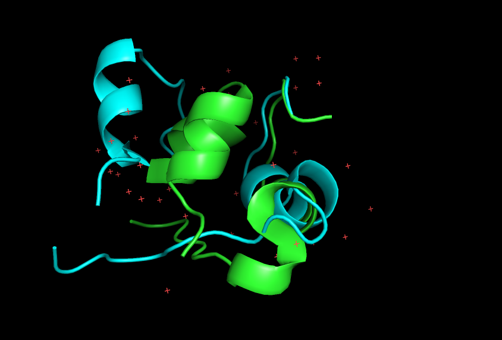
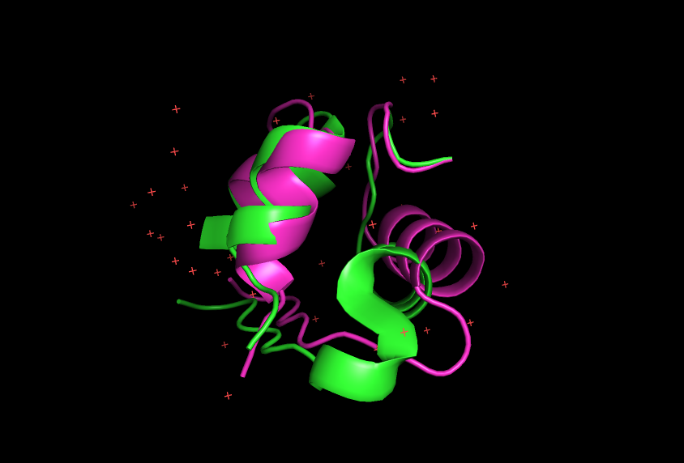
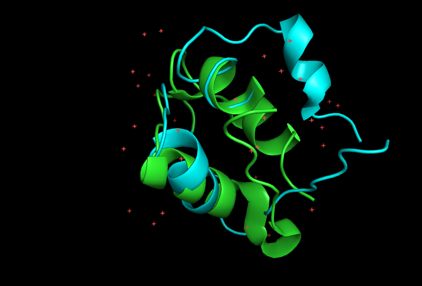
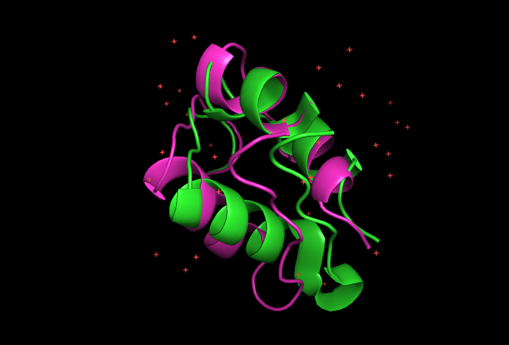

# Optimización en ángulos de torsión de aminoácidos para reducir la energía conformacional de una estructura proteica🧬
Este repositorio implementa un algoritmo de recocido simulado para optimizar la estructura 3D de proteínas, minimizando su energía conformacional mediante la perturbación controlada de ángulos de torsión (φ, ψ, χ). El método utiliza PyRosetta para evaluar energías y ajustar conformaciones, partiendo de un archivo PDB con ruido artificial y generando una estructura refinada más estable.
## Motivación:
Proyecto desarrollado como introducción a la bioinformática computacional, con potencial aplicación en futuras investigaciones o trabajos de tesis
## Estructura del Proyecto

### 📂 Organización de Archivos
proyecto/
├── RecocidoSimulado.py # Algoritmo de optimización (Python)
├── insulina.pdb # Estructura proteica original (target)
├── insulina_con_ruido.pdb # Estructura perturbada (input)
└── Mejores_estructuras/ # Resultados del algoritmo
├── insulina_top1.pdb # Mejor estructura optimizada
├── insulina_top2.pdb
└── ... (8 archivos más)

### Descripción Detallada

| Componente                  | Función                                                                 |
|-----------------------------|-------------------------------------------------------------------------|
| `RecocidoSimulado.py`       | Implementa el algoritmo de recocido simulado para minimizar energía conformacional |
| `insulina.pdb`              | Estructura nativa de referencia (sin perturbaciones)                   |
| `insulina_con_ruido.pdb`    | Versión con ruido artificial en ángulos torsionales (punto de partida) |
| `Mejores_estructuras/`      | Contiene las 10 conformaciones con menor energía encontradas            |

### 📊 Proceso de Optimización
1. **Entrada**: `insulina_con_ruido.pdb` (estructura perturbada)
2. **Algoritmo**: 
   ```python
   python RecocidoSimulado.py --input insulina_con_ruido.pdb --output-dir Mejores_estructuras

## Resultados:
El algoritmo no sólo recuperó una estructura estable desde una conformación distorsionada, sino que alcanzó un mínimo energético más profundo que el de la estructura nativa original, bajo la métrica de la función ref2015_cart.

**Comparación de Energías Conformacionales (REU)**

| Estado               | Energía Conformacional (REU) |
|----------------------|-----------------------------:|
| Original (nativa)    |                  25.8315857401 |
| Perturbada (entrada) |                3833.6422346043 |
| Optimizada (salida)  |                -75.5667352263 |

**_Comparación visual entre la estructura original y la perturbada(izquierda) y la estructura original y la arrojada por el algoritmo._**
**_La original está coloreada en verde, la perturbada en color azul y la optimizada en rosa_**
<p>
  <em>Primer angulo de vista</em>
</p>
<p float="left">
  
   
</p>
<em>Segundo angulo de vista</em>
<p float="left">
  
   
</p>
<em>Tercer angulo de vista</em>
<p float="left">
  
   
</p>

<blockquote>
  <p>📌 <strong>Nota:</strong> Para replicar los resultados, ejecutar <code>python optimize.py --input input.pdb</code>.</p>
</blockquote>
